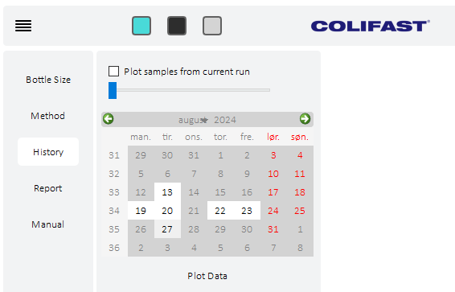

# Colifast ALARM Instrument Manual

**Developed by Stian Eide Ingebrigtsen for Colifast AS**

<h1 id="table-of-contents">Table of Contents</h1>

- [Introduction](#introduction)
- [Getting Started](#getting-started)
- [History](#history)
- [Report](#report)
- [Advanced Menu](#advanced-menu)
  - [ADU](#adu)
  - [Spectrometer](#spectrometer)
  - [Liquid Handling](#liquid-handling)
- [Tips](#tips)

<h1 id="introduction">Introduction</h1>

This software is intended to operate the Colifast ALARM Instrument with its components. Method files can be loaded to run different setups, and you can create files to conduct specific tasks utilizing the components in a customized manner.
[ColifastALARM](link-to-picture-of-CALARM-with-new-software)

---

<h1 id="getting-started">Getting Started</h1>

[Back to ToC](#table-of-contents)

1. **Bottle Size Setup:**
    
   - Navigate to the **Bottle Size** menu and set the size of the medium bottle (typically 21 samples per bottle). 
   - This value is directly responsible for stopping the instrument when there is no medium left.
   - The medium progress bar will display the amount of medium remaining.
   - Ensure this value is correct, as the instrument will not allow a run to start if the remaining medium is set to zero.
   - Clicking the medium progress bar allows the user to register the installation of a new bottle.

   **Note:** You can order a bottle size that suits your frequency of medium bottle change. Most customers use a 21-day bottle for a 3-week change frequency. Volumes for 14 samples are also readily available. Ensure this setting is aligned with the bottle volume.

2. **Method Selection:**

    

   - Navigate to the **Method** section.
   - From the **Method File** drop-down menu, select the file you want the program to run.
   - Select the target bacteria group from the **Analysis** drop-down.
   - Set the frequency of samples:
     - Continuously
     - 24 hours intervals
     - 48 hours intervals
     - Custom interval (in days)

    - **Additional Options**
             
        <table>
        <thead>
        <tr>
            <th>Option</th>
            <th>Explanation</th>
        </tr>
        </thead>
        <tbody>
        <tr>
            <td><strong>Sodium Thiosulfate</strong></td>
            <td>Adds this chelator to the sample. It is used with chlorinated water sources, to "remove" chlorine, which could kill the target bacteria.</td>
        </tr>
        <tr>
            <td><strong>External Sample</strong></td>
            <td>Fills an external bottle with a sample for collection as a reference. Typically used when sending a sample to an accredited lab after a positive bacteria alarm. This option is mutually exclusive with the Alternate sample sources as it make use of the same channel.</td>
        </tr>
        <tr>
            <td><strong>Alternate Sample Sources</strong></td>
            <td>Enables alternating between two sample sources. This option is mutually exclusive with the External sample as it make use of the same channel.</td>
        </tr>
        <tr>
            <td><strong>Delay Before Start</strong></td>
            <td>Delays the starting point of the first sample, allowing the instrument to start at a specific time in the future.</td>
        </tr>
        <tr>
            <td><strong>Remote Start</strong></td>
            <td>Enables remote start/stop of the equipment by calling the modem.</td>
        </tr>
        </tbody>
        </table>
        
---

<h2 id="history">History</h2>

[Back to ToC](#table-of-contents)

 

- In the **History** menu, you can plot historical data based on date. 
- **How to Use:**
  - Click on the date you wish to plot. Dates with sample data are highlighted in white. 
  - If multiple samples are available for a given date, the program will prompt you to select the starting time of the sample you want to plot.
  - You can plot several samples sequentially. Use the slider to select days or check the **plot samples from current run** option to display all samples from that specific run (based on the bottle size setting).

<h2 id="report">Report</h2>

[Back to ToC](#table-of-contents)

 
 

- In the **Reports** menu, you can generate reports:
  - Click the *create report* button to generate a report.
  - The report will be saved in the  `C:\Colifast\Reports`  folder on your local machine.
  - The reports are sorted further in folders by year, month, and then the filename contains the date.

 
 

---

<h1 id="advanced-menu">Advanced Menu</h1>

[Back to ToC](#table-of-contents)

**Note:** We do not recommend operators to access this menu.

- The Advanced menu allows the components to be handled manually. 
- This is a feature for doing service on the equipment.
- The access is password protected, and that is simply to avoid messing with important sample runs. Some of the components are not set up to handle multithreading, and trying to access them whilest a method is running might halt the program.

<h2 id="adu">ADU</h2>

[Back to ToC](#table-of-contents)

 
 

- This page allows the user to manually turn on/off the relays of the **ADU208** relay unit. 
    - There is an *ADU Load* button for initializing and updating the ports of the ADU. 
    - There is a *Reset* button for turning all the relays off.
    - A *Status field* shows the status of the ADU (connected or not).
    - The *Test* button runs read and write calls to all the ports of the device
 
 

<h2 id="spectrometer">Spectrometer</h2>

[Back to ToC](#table-of-contents)

- This page allow the user to load available spectrometers, and run some service tasks related to the spectrometer
    

    #### Calibrate
    - Opens a dialogue that allows you to read the turbidity.
    - This must be done using bottles containing the right turbidity solutions (0, 5, or 10 NTU). 
    - After the value is read the user can choose to **Save New Value to settings**, and thereby updating the calibration value.
    #### Spectrometer operation
    

    - **Readings to avrerage over** is a value that tells the equipment how many readings the spectrometer shall take before it calculates the average and returns the value, default 3 readings.
    - **Integration Time** is the time used by the spectrometer to scan a single reading in milliseconds, deafualt is set to 500 ms (0.5 s).
    #### Fluorescence
    - The **nanometer wavelength** at which the spectrometer reads fluorescence, default is set to 430 nm. 
    - The **threshold**, which is the point at which a sample is interpreted as a positive bacteria alarm - default is 1.5 times the intensity value of the initial baseline measurment.
    - The **UV-LED** button allows the user to turn on/off the UV-LED whilest in the spectrometer interface, this simplifyes the testing of the LED when used in conjunction with the **Spectrometer Liveview** functionality.
    #### Turbidity
    - The **nanometer wavelength** at which the spectrometer reads the turbidity, default is set to 860 nm.
    - The **threshold** is the value for which a turbidity alarm is set. The value is 4 NTU, which is calculated based on 0, 5, and 10 NTU turbidity calibration solutions. 
    - The **IR-LED** button allows the user to turn on/off the Infrared-LED whilest in the spectrometer interface, this simplifyes the testing of the LED when used in conjunction with the **Spectrometer Liveview** functionality.

    #### Spectrograph
    - The **Spectrometer Liveview** button is starting a live plotting of the input to the spectrophotometer, with the wavelength on the x-axis and intensity on the y-axis.      

<h2 id="liquid-handling">Liquid Handling</h2>

[Back to ToC](#table-of-contents)

**Note:** This is not integrated with computational threading and should thus not be used during a sample run. 

- This page allow the user to manualy control the pumps and liquid ports of the system. 

<h3 id="syringe-pump">Syringe Pump</h3>

- **Initialize** the pump at the chosen **Syringe COM port**.
- Send a **Custom command** to the syringe pump using the text field, then press the button.
- Click on the **valve head** to change port, the tooltip shows which port it will change to upon clicking, which is then the oposite of the current port.
- The **Empty** button will make the plunger of the syringe pump go to the very top of the pump, therby emptying it. 
- The **Fill** button will draw the plunger of the syringe to the lower most position therby filling it completely (25 ml).
- The **up-arrow**   will allow you to dispense the volume set in **Syringe Volume (&#956;l)** at the set **Flowrate (&#956;l/s)**.
- The **down-arrow**   will allow you to aspirate the volume set in **Syringe Volume (&#956;l)** at the set **Flowrate (&#956;l/s)**.

COM ports are external connections to computers, that once connected, works almost as integrel parts of the computer. The are therefor often very stable once set up, but if there is some error to the connection they will not propperly reset before the system has undergone a rebooting. That is why we often recommend a reboot when the system has trouble connecting to the syringe pump.

<h3 id="multiposition-valve">Multiposition Valve</h3>

- **Initialize** the valve shifter at the chosen **MPV COM port**.
- The **Syringe pump** is connected to the senter of the **MPV**, and the senter is then linked to one of the 6 channels of the valve.
- Choose a valve and **CLICK** on it to shift to its position, the tooltip will display what the channel is. Default positions are as follows:
 
    <table>
    <tr>
        <th>Channel</th>
        <th>Description</th>
    </tr>
    <tr>
        <td>1</td>
        <td>Waste</td>
    </tr>
    <tr>
        <td>2</td>
        <td>Sample Out/External Sample</td>
    </tr>
    <tr>
        <td>3</td>
        <td>Reagent B (Sodium Thiosulfate)</td>
    </tr>
    <tr>
        <td>4</td>
        <td>Acid</td>
    </tr>
    <tr>
        <td>5</td>
        <td>Sample</td>
    </tr>
    <tr>
        <td>6</td>
        <td>Medium</td>
    </tr>
    </table>

<h3 id="peristaltic-pump">Peristaltic Pump</h3>

- The **Peristaltic pump** picture is also a button that turns on/off the peristaltic pump.

---

<h1 id="tips">Tips</h1>

[Back to ToC](#table-of-contents)

- Stopping
    - The **Stop Button**  
  will abort the program imediately, only stalling if a component are midway through an operation. But if you wish to stop the run after the current sample has ended, right click the button and select **stop run after current sample has ended**.

---

Thank you for using the Colifast ALARM Instrument!
